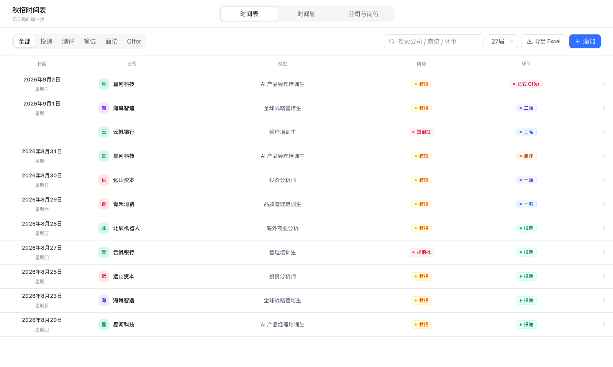
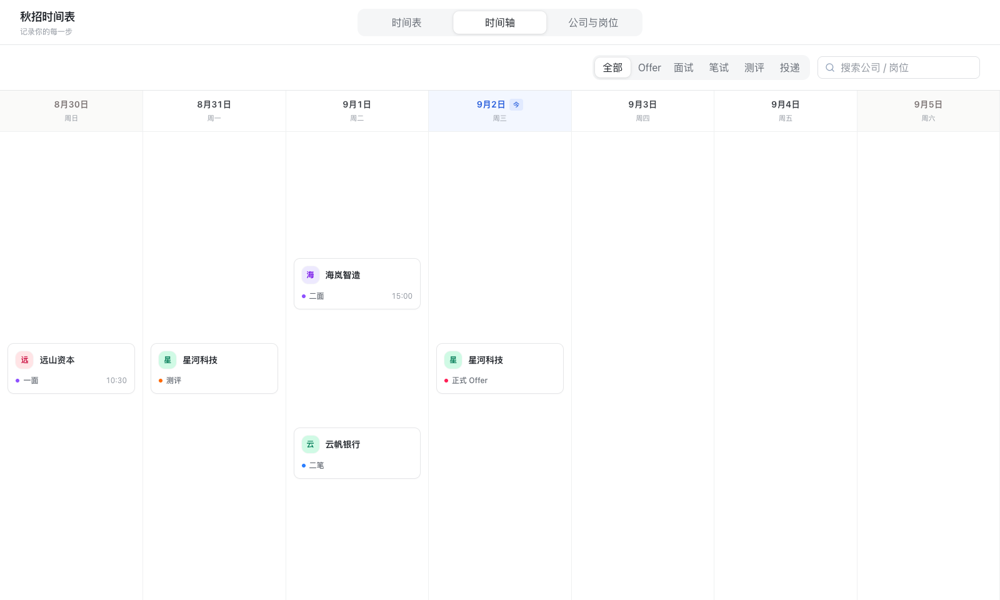
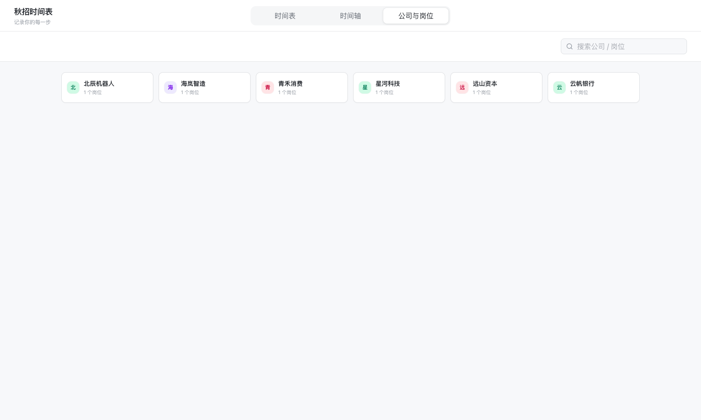
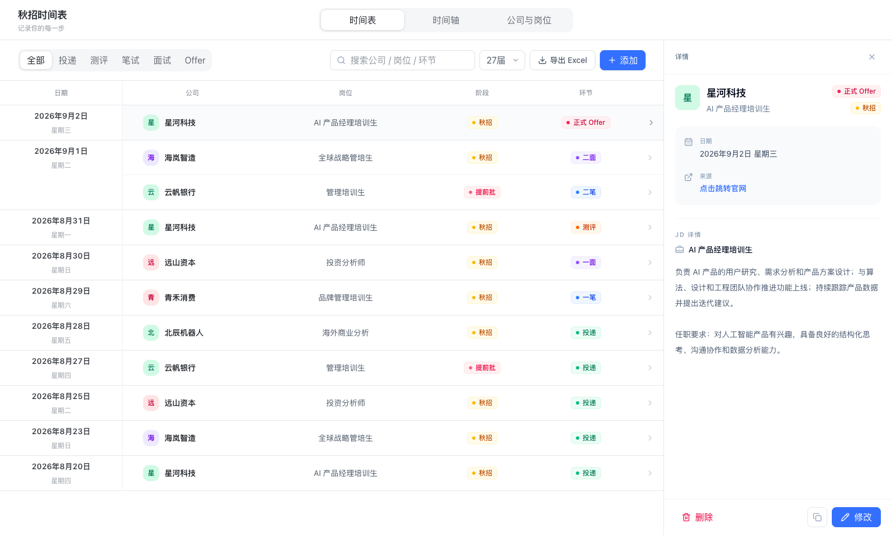

# 秋招时间表

一个面向个人秋招管理的本地优先 Web 应用。它把分散在 Excel 里的投递、测评、笔试、面试和 Offer 整理成清晰的时间表与横向时间轴，并允许直接在网页中新增、复制、修改和删除记录。

如果你也习惯用 Excel 记录秋招，这个小项目可以把“能记下来”进一步变成“随时看得懂”：最近发生的事情按日期倒序排列，岗位 JD 与日程自动关联，新增记录后页面立即同步。

> 仓库中的页面截图、JSON 和 Excel 全部使用虚构演示数据，不包含维护者的真实投递记录。

快速跳转：

[项目目标](#项目目标) · [界面预览](#界面预览) · [功能概览](#功能概览) · [快速开始](#快速开始) · [导入自己的 Excel](#导入自己的-excel)

项目的重点不是统计投递数量，也不是搭建招聘管理后台，而是让使用者快速回答三个实际问题：最近发生了什么、接下来有哪些安排、某个公司和岗位的 JD 是什么。

## 项目目标

秋招信息往往同时存在于 Excel、邮件、招聘官网和日历中。传统表格适合录入，却不适合按时间浏览；日历适合看日期，却很难同时保留岗位、环节和 JD 上下文。

本项目希望在二者之间建立一个轻量工作流：

- 保留现有 Excel 作为初始数据和备份来源。
- 用表格式时间表快速回看完整秋招进展。
- 用横向时间轴连续浏览某一届秋招的每日安排。
- 用公司与岗位视图集中查找 JD 和投递来源。
- 在网页端完成日常维护，不必每次重新编辑 Excel。
- 所有业务数据默认保存在本机，适合包含个人求职信息的使用场景。

## 产品定位

界面采用桌面端优先的 Calendar + Email Timeline 结构，视觉语言接近飞书、Google Calendar、Gmail 和 Notion Calendar：白色背景、浅灰分割线、小圆角、轻阴影和有限的柔和色彩。

设计上坚持以下原则：

- 记录与浏览优先，不展示 Dashboard、KPI 或大型统计卡片。
- 时间信息优先，减少装饰和无关图标。
- 同一家公司在全站使用相同的文字头像与 Pastel 背景色。
- 颜色只用于区分环节标签和少量状态，不使用大面积高饱和背景。
- 复用同一份数据源，所有页面实时保持一致。
- 聚焦桌面端工作流，不以移动端适配为主要目标。

## 界面预览

项目把三种使用场景放在同一套轻量界面里：时间表负责逐条维护，时间轴负责连续浏览，公司与岗位负责查找岗位和 JD。页面保留较高的信息密度，但不使用统计卡片或复杂的后台式菜单。

### 时间表：一行就是一条秋招记录

日期、公司、岗位、阶段和环节横向对齐，同一天的日期单元格会跨行展示，长列表浏览时日期会吸附在顶部。阶段列显示招聘批次，环节列显示投递、测评、笔试、面试及其具体轮次。点击任意一行即可打开详情抽屉。



### 时间轴：连续浏览每天的安排

横向日期列覆盖当前届别的完整日期范围，可以左右滑动查看前后日期；面试、笔试、测评和投递使用小型彩色标记区分，适合快速扫一眼接下来几天的安排。



### 公司与岗位：集中查找公司和 JD

公司以紧凑卡片呈现，每行最多六张；搜索公司或岗位后，点击卡片即可查看该公司的岗位列表、JD、批次和来源链接。



### 详情抽屉：在当前页面查看完整上下文

日程详情包含公司、岗位、环节、招聘批次、日期、来源链接和自动关联的完整 JD。底部可以直接复制、修改或删除当前记录，不需要在多个页面之间来回切换。



## 功能概览

应用顶部固定显示“秋招时间表 / 记录你的每一步”，并在同一行提供三个 Tab：时间表、时间轴、公司与岗位。切换页面时，产品标题始终保留。

### 时间表

时间表是记录维护的主页面，按照日期倒序展示日程，最新日期始终位于最上方。同一天的记录沿用数据层排序。页面采用高信息密度的表格式结构，每条事件严格占一行，字段依次为日期、公司、岗位、阶段和环节；阶段显示招聘批次，环节显示流程及具体轮次。同一天的日期单元格跨越该日全部事件行，并在浏览长日期组时吸附在表头下方。

主要能力包括：

- 按公司、岗位或环节进行模糊搜索。
- 使用“全部 / 投递 / 测评 / 笔试 / 面试 / Offer”筛选器过滤记录。
- 通过“添加”按钮创建新日程。
- 点击任意日程打开右侧详情抽屉。
- 在详情中查看、修改或删除日程。
- 复制已有日程，以当天日期创建一份可继续编辑的新记录。
- 通过“公司 + 岗位”自动关联对应 JD。
- 保存投递来源链接，并在详情中直接访问。

网页表单面向当前工作流，字段包括公司、岗位、日期、招聘批次、环节、环节细分、来源链接和 JD。选择面试后，会在该选项正下方出现一个紧凑输入框，可以填写 `AI`、`一`、`二` 或 `终`，页面对应显示为“AI面”“一面”“二面”或“终面”；选择笔试后可以填写 `一`、`二` 或 `三`，对应显示为“一笔”“二笔”或“三笔”；选择 Offer 后可以直接填写“实习 Offer”或“正式 Offer”。

“添加”适合创建全新公司或岗位记录；“复制”适合延续同一招聘流程。例如收到某个已投岗位的 AI 面试时，可以先搜索原投递记录，打开详情抽屉，点击底部浅灰色复制按钮，再把日期改为今天、环节改为面试并填写 `AI`。保存后原投递记录仍然保留，今天会新增一条“AI面”记录。

Excel 历史数据中的时间、具体事项、地点和备注仍保留在底层模型及导入导出流程中，以保证旧底稿可往返转换；当前网页表单与详情抽屉不把这些兼容字段作为日常编辑项。复制记录时会保留已有兼容字段，只有主动切换环节时才清理与旧事件绑定的内容，避免把“完成投递”等信息带入新面试。

### 时间轴

时间轴是一个只负责浏览的横向 Calendar Dashboard，不在此页面新增日程。它与时间表复用同一份数据，因此在时间表中新增、修改或删除记录后，时间轴会同步更新。

时间轴的核心规则如下：

- 一列代表一个自然日，当前届别范围内的每一天都会生成日期列。
- 日期区域支持触控板横向滑动、Shift + 鼠标滚轮、触摸滑动和鼠标拖拽，横向滚动条保持隐藏；普通鼠标滚轮用于整页纵向浏览。
- 初次进入时自动定位到今天；若今天超出届别范围，则定位到最近的范围边界。
- 一屏约展示七天，日期表头固定在各列顶部。
- 当前页面高度内，每个日期列最多完整展示约 6 张事件卡片。
- 当天不足 6 条记录时，卡片在列内纵向舒展分布。
- 当天超过 6 条记录时，更多卡片随整个时间轴页面向下延展，不再在单个日期列内部滚动；页面下移后仍可横向切换日期。
- 同一天先按“Offer > 面试 > 笔试 > 测评 > 投递”排序，同一环节内再按时间升序排列。
- 顶部搜索框左侧提供“全部 / Offer / 面试 / 笔试 / 测评 / 投递”筛选器。
- 点击事件卡片继续复用时间表的详情抽屉。

卡片只展示浏览所需的公司头像、公司名和环节或具体轮次。面试卡片在已填写时间时显示具体时间；投递、测评和笔试卡片不显示右下角时间文字。

### 公司与岗位

该页面读取岗位数据，以紧凑的公司卡片展示已投递公司和岗位。桌面宽度下一行最多排列六张公司卡片，并提供公司或岗位搜索。

点击公司后可查看：

- 公司下的全部岗位。
- 岗位对应的完整 JD。
- 招聘批次与来源链接。
- 程序自动识别的公司类别。

公司列表初始保持收起，点击公司卡片后才展开岗位列表。公司别名会在视图和 JD 关联中统一归并，例如“阿里”和“阿里巴巴”共同显示为“阿里巴巴”。

公司类别分为金融公司、互联网大厂和实业公司。分类规则集中维护在 `lib/companyClassifier.ts` 中，便于继续扩展。

分类优先级为：

1. 命中互联网或科技公司名单时，归为互联网大厂。
2. 未命中名单但公司名称包含基金、证券、银行、保险、资本、投资、资管等金融关键词时，归为金融公司。
3. 其余公司归为实业公司。

## 届别与日期范围

届别是全局视图状态，内部保存完整毕业年份。例如界面中的“27届”在程序中保存为 `2027`。

对于毕业年份 `Y`，统一日期范围为：

```text
开始日期：Y - 1 年 3 月 1 日
结束日期：Y 年 7 月 1 日
```

例如：

- 27届：2026-03-01 至 2027-07-01。
- 28届：2027-03-01 至 2028-07-01。
- 29届：2028-03-01 至 2029-07-01。

这套规则由 `lib/cohort.ts` 统一计算，没有在各页面分别写死。届别选择器、导出 Excel 和添加按钮只出现在时间表页面；其中届别状态仍由全局 Context 管理。切换届别后，时间表、时间轴、公司与岗位页面以及新增日程的日期约束会立即同步。

届别只负责视图过滤和日期输入约束，不会删除范围外的数据。底层数据可以同时保存多个届别的记录。

## 数据工作流

项目采用本地优先的数据链路：

```text
Excel 底稿
   ↓ 首次导入或手动重新导入
字段识别与标准化
   ↓
data/data.json
   ↓
时间表 / 时间轴 / 公司与岗位
   ↓ 网页端新增、修改、删除
data/data.json
   ↓
导出新的 Excel 备份
```

网页端的日常操作不会覆盖源 Excel。数据文件写入采用原子替换、写后校验、历史快照和跨进程文件锁；同一进程内的请求也会串行完成完整的“读取—修改—写入”事务。两个标签页同时修改同一条记录时，后提交的旧版本会收到冲突提示，不会静默覆盖先保存的内容。

岗位层面的 JD、招聘批次和来源链接按规范化后的“公司 + 岗位”共享。修改公司或岗位后，程序会同步维护新索引，并清理不再被任何日程引用的旧索引；带有待补日期进展的独立岗位会继续保留。

### 导出 Excel

“导出 Excel”位于时间表页面搜索框右侧。导出时会沿用当前届别、环节筛选和搜索词，只把此刻页面范围内的记录写入工作簿；清除筛选后再导出，即可得到当前届别的完整备份。工作簿包含“总览”和“JD”两个 Sheet，并保留招聘批次、面试/笔试轮次、Offer 类型、来源链接以及兼容旧底稿的时间、事项、地点和备注字段。

推荐的日常习惯是：平时直接在网页中维护，重要修改后导出一份带日期的 Excel 备份；只有需要用旧底稿重新生成数据时，才执行 `pnpm import:excel`。导入会覆盖本地 JSON，因此程序会先校验工作簿并拒绝无法识别或意外为空的文件。

### 公开演示数据与本地真实数据

项目刻意把“可以公开的演示数据”和“只属于你的真实数据”分开：

- `data/demo-data.json`：随仓库发布的虚构演示数据，供首次克隆后直接预览页面。
- `demo/秋招进度_演示.xlsx`：字段齐全的虚构 Excel 示例，可用来了解导入格式。
- `data/data.json`：程序实际读写的本地数据。首次启动会由演示数据自动生成，之后每次网页保存都会自动落盘；该文件已被 Git 忽略。
- `秋招进度.xlsx`：你自己的 Excel 底稿。文件放在项目根目录即可导入，但同样已被 Git 忽略。

因此，克隆项目的人只会拿到虚构示例；你在本机网页中添加、复制、修改或删除的记录不会因为普通的 `git add` 或 `git push` 被上传。网页保存不需要按 `Ctrl + S`，点击“保存”后即写入本地 `data/data.json`。

## Excel 导入规则

默认从项目根目录的 `秋招进度.xlsx` 读取数据。也可以通过 `RECRUITMENT_EXCEL_PATH` 指定另一个绝对路径。

解析器优先查找：

- 日程 Sheet：`总览`
- JD Sheet：`JD`

如果找不到这两个名称，会分别回退到工作簿的第一个和第二个 Sheet。

### 日程 Sheet 字段映射

解析器会按真实表头自动匹配以下别名：

- 公司：`公司`、`企业`、`公司名称`
- 岗位：`岗位`、`职位`、`岗位名称`、`职位名称`
- 批次：`批次`、`招聘批次`
- 投递日期：`投递日期`、`申请日期`、`日期`
- 进度：`进度`、`投递进展`、`流程`（规范导出表的 `环节` 会按单条日程解析）
- 来源链接：`链接`、`申请链接`、`投递链接`

进度单元格可以包含多行记录。例如：

```text
2026/08/31 15:00 一面
9/2 在线测评
9/5 19:00 笔试
```

解析器会从每一行识别日期、时间和事项，并根据关键词归类为投递、测评、笔试、面试或 Offer。省略年份的日期会参考投递日期处理跨年情况；无法识别为独立日期事件的文本，在有投递日期时保留在投递记录备注中，没有投递日期时保存在岗位的 `pendingProgress` 字段中，不会静默丢失。

导出文件的规范总览表使用“日期 / 环节 / 具体事项”等字段，解析器会自动识别该格式并逐条恢复时间、地点、链接、备注和来源。旧版“投递日期 / 进度”格式仍然兼容。

### JD Sheet 字段映射

JD Sheet 通过“公司 + 岗位”与日程关联，支持以下别名；如果公司/岗位单元格是 `=总览!A2` 一类公式，会解析公式的明确引用，不依赖压缩后的行号：

- 公司：`公司`、`企业`、`公司名称`
- 岗位：`岗位`、`职位`、`岗位名称`、`职位名称`
- JD：`JD`、`岗位JD`、`职位描述`、`岗位描述`

缺少可选字段时，程序会保留可用内容并继续导入。日程详情中没有完全匹配的 JD 时，会显示待补充提示。

## 快速开始

### 环境要求

- Node.js 20 或更高版本。
- pnpm 10；项目在 `package.json` 中声明了推荐版本。

### 安装与启动

```bash
git clone https://github.com/tank798/Fall-Recruitment-Submission-Calendar.git
cd Fall-Recruitment-Submission-Calendar
pnpm install
pnpm dev --hostname 127.0.0.1 --port 3000
```

浏览器打开：

```text
http://127.0.0.1:3000
```

如需使用正式运行模式：

```bash
pnpm build
pnpm start --hostname 127.0.0.1 --port 3000
```

macOS 用户也可以双击项目中的 `启动秋招时间表.command`。该脚本会检查运行环境、在需要时构建项目，并自动打开本地页面。

## 导入自己的 Excel

将底稿放到项目根目录并命名为 `秋招进度.xlsx`，然后运行：

```bash
pnpm import:excel
```

也可以保留 Excel 原文件名并显式指定路径：

```bash
RECRUITMENT_EXCEL_PATH="/absolute/path/to/your-workbook.xlsx" pnpm import:excel
```

`pnpm import:excel` 会以 Excel 重新生成本地 `data/data.json`。若 JSON 中已经包含网页端新增或修改的记录，请先在时间表页面使用“导出 Excel”保存一份当前版本，再执行重新导入。

如果选错工作簿、表头无法识别，或解析结果没有任何日程，导入命令会在覆盖前中止，原有 `data/data.json` 保持不变。只有明确需要导入一份空日程数据时，才使用：

```bash
pnpm import:excel -- --allow-empty
```

当 `data/data.json` 尚不存在时，应用首次启动也会自动尝试从 Excel 初始化。

## 常用命令

```bash
# 启动开发服务器
pnpm dev

# TypeScript 类型检查
pnpm typecheck

# 生成生产构建
pnpm build

# 启动生产服务器
pnpm start

# 从 Excel 重建本地数据
pnpm import:excel

# 运行 Excel、数据存储回归
pnpm test

# 运行 ESLint
pnpm lint
```

## API

当前版本提供以下本地 API：

- `GET /api/schedules`：读取完整日程与岗位数据。
- `POST /api/schedules`：创建日程。
- `PATCH /api/schedules/:id`：修改指定日程。
- `DELETE /api/schedules/:id`：删除指定日程。
- `GET /api/export`：导出 Excel；可传 `graduationYear`、`stage`、`search` 参数，导出当前届别和筛选条件下的可见数据。不传参数时导出完整数据。

创建和修改请求由 Zod 校验。修改请求携带记录的 `updatedAt` 版本；版本不一致时服务端返回 `409 Conflict`，由界面提示用户重新打开最新记录。

## 目录结构

```text
.
├── app/
│   ├── api/                    # 日程 CRUD 与 Excel 导出接口
│   ├── globals.css             # 全局视觉、布局与时间轴滚动样式
│   └── page.tsx                # 服务端入口与初始数据加载
├── components/
│   ├── TimelinePage.tsx        # 表格式时间表
│   ├── TimeAxisPage.tsx        # 横向时间轴
│   ├── HorizontalDateBoard.tsx # 连续日期与横向拖拽
│   ├── DateColumn.tsx          # 单日列与六卡展示规则
│   ├── CompaniesPage.tsx       # 公司与岗位浏览
│   ├── AddScheduleModal.tsx    # 新增与修改表单
│   └── ScheduleDetailDrawer.tsx# 日程详情抽屉
├── lib/
│   ├── cohort.ts               # 届别和日期范围规则
│   ├── companyClassifier.ts    # 公司自动分类
│   ├── companyNames.ts         # 公司别名归并
│   ├── dataStore.ts            # 本地 JSON 数据层
│   ├── excelParser.ts          # Excel 解析与字段映射
│   ├── excelExport.ts          # Excel 导出
│   ├── importValidation.ts      # Excel 覆盖导入安全检查
│   └── types.ts                # 共享数据类型
├── scripts/
│   └── import-excel.ts         # 手动导入命令
├── data/
│   ├── demo-data.json          # 公开的虚构演示数据
│   └── data.json               # 本地真实数据（首次启动生成，Git 忽略）
├── demo/
│   └── 秋招进度_演示.xlsx       # 公开的虚构 Excel 示例
├── docs/
│   └── screenshots/             # README 使用的界面截图
└── 启动秋招时间表.command       # macOS 快速启动脚本
```

## 数据模型

一条日程主要包含：

- `company`：公司。
- `position`：岗位。
- `date`：ISO 日期，格式为 `YYYY-MM-DD`。
- `stage`：投递、测评、笔试、面试或 Offer。
- `interviewRound`：面试轮次中“面”字前的内容，例如 `AI`、`一`、`二` 或 `终`。
- `writtenRound`：笔试轮次中“笔”字前的内容，例如 `一`、`二` 或 `三`。
- `offerType`：Offer 的具体类型，例如 `实习 Offer` 或 `正式 Offer`。
- `sourceLink`：投递来源。

为兼容旧 Excel，日程模型还保留 `time`、`detail`、`location` 和 `notes` 字段；这些字段参与 Excel 导入导出，但不出现在当前网页表单中。

一条岗位数据主要包含公司、岗位、JD、公司类别、招聘批次、来源链接和可选的 `pendingProgress`（待补日期进展）。日程与 JD 使用规范化后的“公司 + 岗位”作为关联键，因此同一公司、同一岗位的多条日程共享岗位资料。

## 继续开发

项目按页面、复用组件、业务规则和数据层拆分，新增能力时可以沿以下边界扩展：

- 新增公司分类词条：修改 `lib/companyClassifier.ts`。
- 调整届别日期规则：修改 `lib/cohort.ts`。
- 增加 Excel 表头别名：修改 `lib/excelParser.ts`。
- 调整日程字段校验：修改 `lib/scheduleSchema.ts`。
- 修改时间轴密度：修改 `components/DateColumn.tsx` 与对应 CSS。
- 接入 SQLite 或其他存储：保持现有 API 与 `RecruitmentStore` 数据结构，可替换 `lib/dataStore.ts` 的持久化实现。

## 发布前检查

提交代码前建议运行：

```bash
pnpm typecheck
pnpm lint
pnpm test
pnpm build
```

公开发布前无需暂存 `秋招进度.xlsx` 或 `data/data.json`，它们本来就应当保持在 Git 之外。若需要更新开源演示内容，只修改 `data/demo-data.json`、`demo/秋招进度_演示.xlsx` 和 `docs/screenshots/`，并再次确认其中没有真实姓名、公司投递记录或可识别的招聘链接。
