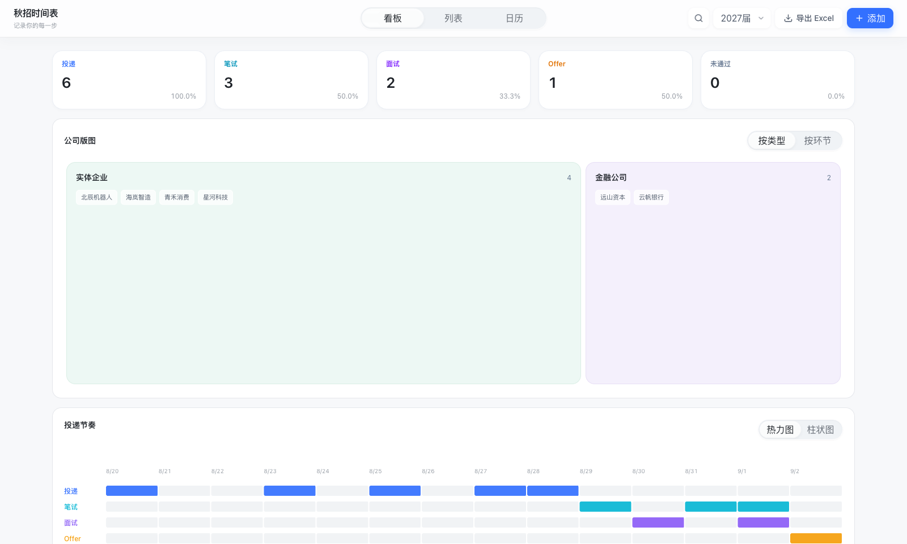
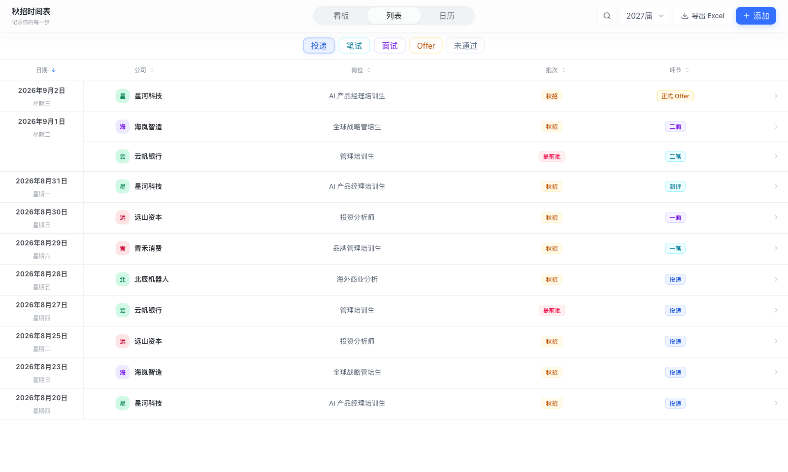
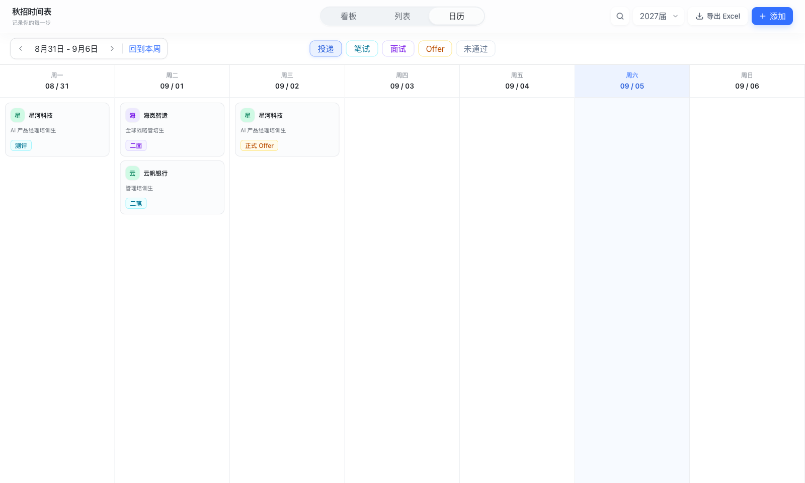
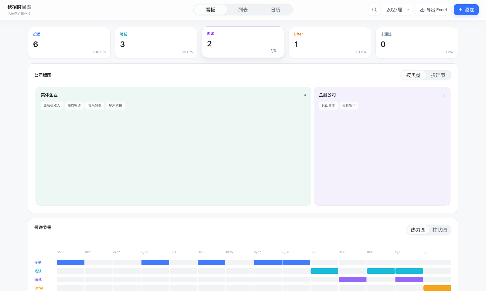

# 秋招时间表

一个本地优先的个人秋招管理工具。用「看板 / 列表 / 日历」查看投递进展、管理日程和浏览公司岗位 JD，支持网页新增、复制、修改、删除，以及 Excel 导入导出。

> 仓库中的 JSON、Excel 和界面截图均使用虚构演示数据。个人真实记录、自动备份和隔离文件不进入 Git。

## 项目目标

把投递记录、流程进展和岗位信息放在同一处，减少 Excel、邮件和招聘官网之间的反复查找。页面共用同一份本地数据，保存成功后立即同步，关闭浏览器后数据仍在。

桌面端优先，白色基底、主蓝色操作、轻量导航和高信息密度。顶栏统一提供搜索、届别选择、导出 Excel 和添加。搜索浮层保持展开，直到点击清除或按 Esc。

## 三个页面怎么用

### 看板

从上到下是五张进展卡片、公司版图和投递节奏图。

- 核心进展按「公司 + 岗位」去重。同一岗位的一面、二面只计一次面试；投递代表全部已投岗位。笔试、面试和未通过比例以全部岗位为分母，Offer 比例以面试岗位为分母，各状态可重叠。
- 每张进展卡片右下角的百分比可以单独点击：文字会以平滑翻转显示实际分数（例如 `2/6`），再次点击恢复百分比；分子和分母都随当前数据实时计算。
- 公司分布图支持「按类型 / 按环节」切换，按对应的已投岗位数量分配面积；零岗位分组不占虚构面积。点击区域即可浏览该组公司，支持搜索和拼音首字母分组。
- 投递节奏支持热力图、堆叠柱状图切换。两图均覆盖首条至末条记录的连续自然日，包含没有记录的日期。悬停可查看当天五种环节的数量和总数。这里统计事件次数，与顶部去重岗位数不同。
- 类型包括互联网大厂、金融公司、实体企业、央国企。放大浏览后，点击公司打开原有公司详情，再点击岗位查看 JD、批次和来源。可点击外部、关闭按钮或 Esc 返回。新增、修改和删除记录后，图表与公司浏览内容同步更新。

分类规则集中在 `lib/companyClassifier.ts`。旧版「实业公司」在读取时兼容迁移，岗位和 JD 保留。

### 列表

每条事件一行：日期、公司、岗位、批次、环节。默认日期倒序，相邻同日记录合并日期单元格，向下滚动时日期吸附在表头下方。点击表头可切换日期、公司、岗位、批次或环节的升降序。长岗位名单行省略，悬停显示完整名称。

筛选仅显示投递、笔试、面试、Offer、未通过五项。投递代表全量；点击其他状态筛选，再点一次取消。没有匹配记录时显示「暂无数据」。列表与日历共享筛选状态。

点击一行打开详情抽屉，查看日期、来源和完整 JD。底部可复制、修改或删除记录。例如收到同岗位 AI 面试时，复制原投递记录，把日期和环节改为面试，填写 AI 后保存，原投递记录仍保留。

添加与修改表单支持公司、岗位、日期、批次、环节、环节细分、来源链接与 JD。面试可填一、二、AI、终等前缀；笔试可填一、二、三；Offer 可填实习、正式。旧测评兼容为「笔试 / 测评」。

### 日历

日历默认展示周一至周日连续七天，并与上方工具栏直接衔接。相邻周保留在可视区域外，左右箭头每次平滑滑动一周；「回到今天」定位当前周。点击周日期范围，使用年份切换和 3 × 4 月份网格快速跳转。所有日期共用滚动区域，纵向浏览较多记录时仍可横向滑动。

每张卡片展示公司、岗位和具体环节，点击后打开与列表相同的详情抽屉。筛选后仍保留七天的日期列，空日期不消失。超出当前届别的边界日期淡化显示。

## Excel 和保存

网页保存成功后自动写入本地数据，无需 Ctrl+S。详情里的复制会新增一条记录，修改会更新原记录。Excel 导出位于全局顶栏，列表和日历导出当前届别、搜索及状态筛选结果；看板导出当前届别和搜索结果。

Excel 导入属于显式操作，启动不会用旧 Excel 覆盖网页数据。文件损坏优先从自动备份恢复；不可解析内容隔离留证。每次写入前保留备份，跨进程锁和版本校验用于避免并发覆盖。

## 界面预览（演示数据）

下面的截图来自仓库内的虚构演示数据，用于快速了解三个页面和百分比公式交互。你自己的本地数据不会出现在这些图片中。

### 看板



### 列表



### 日历



### 百分比公式



## 届别与日期范围

届别是全局视图状态，内部保存完整毕业年份。例如界面中的“2027届”在程序中保存为 `2027`。

对于毕业年份 `Y`，统一日期范围为：

```text
开始日期：Y - 1 年 3 月 1 日
结束日期：Y 年 7 月 1 日
```

例如：

- 27届：2026-03-01 至 2027-07-01。
- 28届：2027-03-01 至 2028-07-01。
- 29届：2028-03-01 至 2029-07-01。

这套规则由 `lib/cohort.ts` 统一计算，没有在各页面分别写死。届别选择器是全局状态；切换后，看板、列表、日历页面以及新增日程的日期约束会立即同步。搜索、届别、导出 Excel 和添加操作收纳在全局顶部栏。

届别只负责视图过滤和日期输入约束，不会删除范围外的数据。底层数据可以同时保存多个届别的记录。

## 数据工作流

项目采用本地优先的数据链路：

```text
Excel 底稿
   ↓ 显式执行导入命令
字段识别与标准化
   ↓
data/data.json
   ↓
看板 / 列表 / 日历
   ↓ 网页端新增、修改、删除
data/data.json
   ↓
导出新的 Excel 备份
```

网页端的日常操作不会覆盖源 Excel。数据文件写入采用原子替换、写后校验、历史快照和跨进程文件锁；同一进程内的请求也会串行完成完整的“读取—修改—写入”事务。两个标签页同时修改同一条记录时，后提交的旧版本会收到冲突提示，不会静默覆盖先保存的内容。

启动时若发现 `data/data.json` 损坏，程序会优先从 `data/backups/` 恢复最新可用快照。如果主文件和自动备份都不可读，程序会停止启动，不会再用过期 Excel、演示数据或空库覆盖当前数据。`data/manual-backups/`、迁移前快照和临时备份均已被 Git 忽略。

岗位层面的 JD、招聘批次和来源链接按规范化后的“公司 + 岗位”共享。修改公司或岗位后，程序会同步维护新索引，并清理不再被任何日程引用的旧索引；带有待补日期进展的独立岗位会继续保留。

### 导出 Excel

“导出 Excel”会沿用当前届别、环节筛选和搜索词，只把此刻页面范围内的记录写入工作簿；清除筛选后再导出，即可得到当前届别的完整备份。工作簿包含“总览”和“JD”两个 Sheet，并保留招聘批次、面试/笔试轮次、Offer 类型、未通过说明和来源链接。

推荐的日常习惯是：平时直接在网页中维护，重要修改后导出一份带日期的 Excel 备份；只有需要用旧底稿重新生成数据时，才执行 `pnpm import:excel`。导入会覆盖本地 JSON，因此程序会先校验工作簿并拒绝无法识别或意外为空的文件。

### 公开演示数据与本地真实数据

项目刻意把“可以公开的演示数据”和“只属于你的真实数据”分开：

- `data/demo-data.json`：随仓库发布的虚构演示数据，供首次克隆后直接预览页面。
- `demo/秋招进度_演示.xlsx`：字段齐全的虚构 Excel 示例，可用来了解导入格式。
- `data/data.json`：程序实际读写的本地数据。首次启动会由演示数据自动生成，之后每次网页保存都会自动落盘；该文件已被 Git 忽略。
- `秋招进度.xlsx`：你自己的 Excel 底稿。文件放在项目根目录即可导入，但同样已被 Git 忽略。

因此，克隆项目的人只会拿到虚构示例；你在本机网页中添加、复制、修改或删除的记录不会因为普通的 `git add` 或 `git push` 被上传。网页保存不需要按 `Ctrl + S`，点击“保存”后即写入本地 `data/data.json`。

## Excel 导入规则

默认从项目根目录的 `秋招进度.xlsx` 读取数据。也可以通过 `RECRUITMENT_EXCEL_PATH` 指定另一个绝对路径。

解析器优先查找：

- 日程 Sheet：`总览`
- JD Sheet：`JD`

如果找不到这两个名称，会分别回退到工作簿的第一个和第二个 Sheet。

### 日程 Sheet 字段映射

解析器会按真实表头自动匹配以下别名：

- 公司：`公司`、`企业`、`公司名称`
- 岗位：`岗位`、`职位`、`岗位名称`、`职位名称`
- 批次：`批次`、`招聘批次`
- 投递日期：`投递日期`、`申请日期`、`日期`
- 进度：`进度`、`投递进展`、`流程`（规范导出表的 `环节` 会按单条日程解析）
- 来源链接：`链接`、`申请链接`、`投递链接`

进度单元格可以包含多行记录。例如：

```text
2026/08/31 15:00 一面
9/2 在线测评
9/5 19:00 笔试
```

解析器会从每一行识别日期和事项，并根据关键词归类为投递、笔试、面试、Offer 或未通过；测评会归入笔试并保留“测评”细分文案。省略年份的日期会参考投递日期处理跨年情况；无法识别为独立日期事件的文本保存在岗位的 `pendingProgress` 字段中，不会静默丢失。

导出文件的规范总览表使用“日期 / 环节 / 环节细分 / 来源链接”等字段，解析器会自动识别该格式并逐条恢复。旧版“投递日期 / 进度”格式仍然兼容。

### JD Sheet 字段映射

JD Sheet 通过“公司 + 岗位”与日程关联，支持以下别名；如果公司/岗位单元格是 `=总览!A2` 一类公式，会解析公式的明确引用，不依赖压缩后的行号：

- 公司：`公司`、`企业`、`公司名称`
- 岗位：`岗位`、`职位`、`岗位名称`、`职位名称`
- JD：`JD`、`岗位JD`、`职位描述`、`岗位描述`

缺少可选字段时，程序会保留可用内容并继续导入。日程详情中没有完全匹配的 JD 时，会显示待补充提示。

## 快速开始

### 环境要求

- Node.js 20 或更高版本。
- pnpm 10；项目在 `package.json` 中声明了推荐版本。

### 安装与启动

```bash
git clone https://github.com/tank798/Fall-Recruitment-Submission-Calendar.git
cd Fall-Recruitment-Submission-Calendar
pnpm install
pnpm dev --hostname 127.0.0.1 --port 3000
```

浏览器打开：

```text
http://127.0.0.1:3000
```

如需使用正式运行模式：

```bash
pnpm build
pnpm start --hostname 127.0.0.1 --port 3000
```

macOS 用户也可以双击项目中的 `启动秋招时间表.command`。该脚本会检查运行环境、在需要时构建项目，并自动打开本地页面。

### Vercel UI 预览

项目可以直接连接 GitHub 仓库并部署到 Vercel，用于远程查看和审核 UI。Vercel 运行时只读取 `data/demo-data.json`，不会上传或读取本机的 `data/data.json`。添加、修改和删除请求会返回“仅用于 UI 预览”提示，不会伪装保存。

本地使用时不受这个限制，点击保存后仍会立即写入本地 `data/data.json`。

## 导入自己的 Excel

将底稿放到项目根目录并命名为 `秋招进度.xlsx`，然后运行：

```bash
pnpm import:excel
```

也可以保留 Excel 原文件名并显式指定路径：

```bash
RECRUITMENT_EXCEL_PATH="/absolute/path/to/your-workbook.xlsx" pnpm import:excel
```

`pnpm import:excel` 会以 Excel 重新生成本地 `data/data.json`。若 JSON 中已经包含网页端新增或修改的记录，请先在列表页面使用“导出 Excel”保存一份当前版本，再执行重新导入。

如果选错工作簿、表头无法识别，或解析结果没有任何日程，导入命令会在覆盖前中止，原有 `data/data.json` 保持不变。只有明确需要导入一份空日程数据时，才使用：

```bash
pnpm import:excel -- --allow-empty
```

为避免用过期 Excel 覆盖网页端新数据，应用启动时不再自动用 Excel 重建 `data/data.json`。Excel 导入只通过显式执行 `pnpm import:excel` 触发。

## 常用命令

```bash
# 启动开发服务器
pnpm dev

# TypeScript 类型检查
pnpm typecheck

# 生成生产构建
pnpm build

# 启动生产服务器
pnpm start

# 从 Excel 重建本地数据
pnpm import:excel

# 运行 Excel、数据存储回归
pnpm test

# 运行 ESLint
pnpm lint
```

## API

当前版本提供以下本地 API：

- `GET /api/schedules`：读取完整日程与岗位数据。
- `POST /api/schedules`：创建日程。
- `PATCH /api/schedules/:id`：修改指定日程。
- `DELETE /api/schedules/:id`：删除指定日程。
- `GET /api/export`：导出 Excel；可传 `graduationYear`、`stage`、`search` 参数，导出当前届别和筛选条件下的可见数据。不传参数时导出完整数据。

创建和修改请求由 Zod 校验。修改请求携带记录的 `updatedAt` 版本；版本不一致时服务端返回 `409 Conflict`，由界面提示用户重新打开最新记录。

## 目录结构

```text
.
├── app/
│   ├── api/                    # 日程 CRUD 与 Excel 导出接口
│   ├── globals.css             # 全局视觉、布局与时间轴滚动样式
│   └── page.tsx                # 服务端入口与初始数据加载
├── components/
│   ├── DashboardPage.tsx       # 看板总览
│   ├── CompanyTreemap.tsx      # 公司版图与公司浏览
│   ├── DailyFlowChart.tsx      # 投递节奏热力图 / 柱状图
│   ├── TimelinePage.tsx        # 表格式列表
│   ├── WeeklyCalendarPage.tsx  # 七天周日历
│   ├── StageFilterPills.tsx    # 共享环节筛选器
│   ├── AddScheduleModal.tsx    # 新增与修改表单
│   └── ScheduleDetailDrawer.tsx# 日程详情抽屉
├── lib/
│   ├── cohort.ts               # 届别和日期范围规则
│   ├── companyClassifier.ts    # 公司自动分类
│   ├── companyNames.ts         # 公司别名归并
│   ├── dataStore.ts            # 本地 JSON 数据层
│   ├── excelParser.ts          # Excel 解析与字段映射
│   ├── excelExport.ts          # Excel 导出
│   ├── importValidation.ts      # Excel 覆盖导入安全检查
│   └── types.ts                # 共享数据类型
├── scripts/
│   └── import-excel.ts         # 手动导入命令
├── data/
│   ├── demo-data.json          # 公开的虚构演示数据
│   └── data.json               # 本地真实数据（首次启动生成，Git 忽略）
├── demo/
│   └── 秋招进度_演示.xlsx       # 公开的虚构 Excel 示例
├── docs/
│   └── screenshots/             # README 使用的界面截图
└── 启动秋招时间表.command       # macOS 快速启动脚本
```

## 数据模型

一条日程主要包含：

- `company`：公司。
- `position`：岗位。
- `date`：ISO 日期，格式为 `YYYY-MM-DD`。
- `stage`：投递、笔试、面试、Offer 或未通过；测评作为笔试的具体类型保存。
- `interviewRound`：完整的面试细分文案，例如 `AI面`、`一面`、`二面` 或 `终面`。
- `writtenRound`：完整的笔试细分文案，例如 `测评`、`一笔`、`二笔` 或 `三笔`。
- `offerType`：Offer 的具体类型，例如 `实习 Offer` 或 `正式 Offer`。
- `failNote`：未通过的细分说明，例如 `简历挂` 或 `一面挂`。
- `sourceLink`：投递来源。

一条岗位数据主要包含公司、岗位、JD、公司类别、招聘批次、来源链接和可选的 `pendingProgress`（待补日期进展）。日程与 JD 使用规范化后的“公司 + 岗位”作为关联键，因此同一公司、同一岗位的多条日程共享岗位资料。

## 继续开发

项目按页面、复用组件、业务规则和数据层拆分，新增能力时可以沿以下边界扩展：

- 新增公司分类词条：修改 `lib/companyClassifier.ts`。
- 调整届别日期规则：修改 `lib/cohort.ts`。
- 增加 Excel 表头别名：修改 `lib/excelParser.ts`。
- 调整日程字段校验：修改 `lib/scheduleSchema.ts`。
- 修改日历卡片密度：修改 `components/WeeklyCalendarPage.tsx` 与对应 CSS。
- 接入 SQLite 或其他存储：保持现有 API 与 `RecruitmentStore` 数据结构，可替换 `lib/dataStore.ts` 的持久化实现。

## 发布前检查

提交代码前建议运行：

```bash
pnpm typecheck
pnpm lint
pnpm test
pnpm build
```

公开发布前无需暂存 `秋招进度.xlsx` 或 `data/data.json`，它们本来就应当保持在 Git 之外。若需要更新开源演示内容，只修改 `data/demo-data.json`、`demo/秋招进度_演示.xlsx` 和 `docs/screenshots/`，并再次确认其中没有真实姓名、公司投递记录或可识别的招聘链接。
